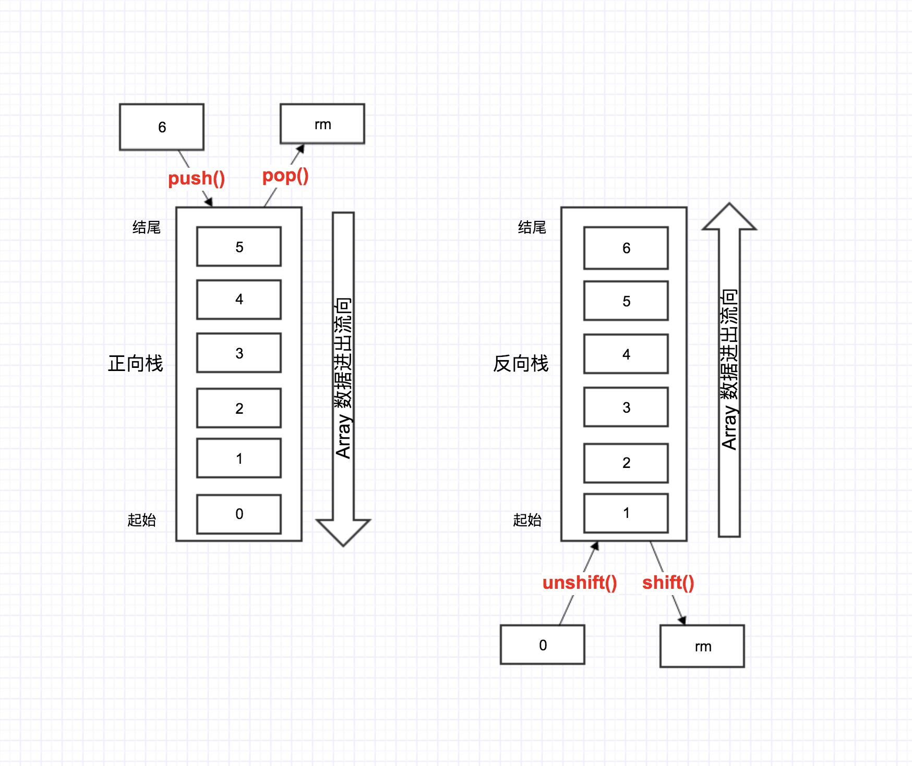
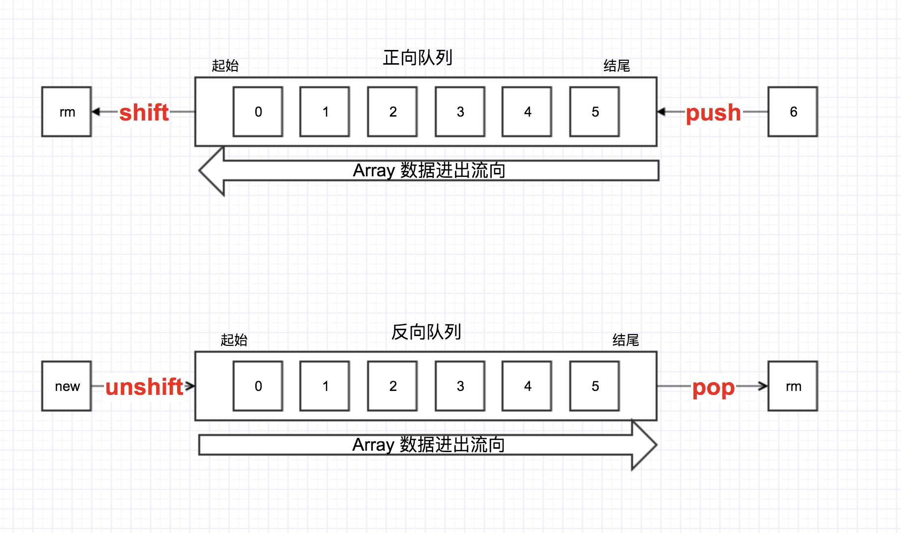

# JavaScript 引用数据类型

本章内容较多，
引用类型的值（对象）是引用类型的一个实例。引用类型是一种数据结构，用于将数据和功能组织在一起。
ECMAScript 提供了很多原生引用类型。


## 目录

JavaScript 引用数据类型

- 1、Object类型
    - 1.1、创建对象的方式
    - 1.2、读取对象属性
- 2、Array类型
    - 2.1、创建方式
    - 2.2、读取方式
    - 2.3、检测数组
    - 2.4、转换方法
    - 2.5、栈方法
    - 2.6、队列方法
    - 2.7、栈、队列小结
        - 1. 栈的使用
        - 2. 队列的使用
    - 2.7、重排序方法
    - 2.8、操作方法
        - 1. concat() 用于合并两个或多个数组。此方法不会更改现有数组，而是返回一个新数组。
        - 2. slice() 返回一个从开始到结束（不包括结束）选择的数组的一部分浅拷贝到一个新数组对象。原始数组不会被修改。
        - 3. splice() 通过删除现有元素和/或添加新元素来更改一个数组的内容。
    - 2.9、位置方法
        - 1. indexOf()、lastIndexOf() 方法返回在数组中可以找到一个给定元素的第一个索引，如果不存在，则返回-1。indexOf() 从数组开头向后查找, lastIndexOf() 从数组末尾开始向前查找。
        - 2. 使用场景
    - 2.10、迭代方法


## 1、Object类型


### 1.1、创建对象的方式：

1. 使用构造函数：

```javascript
var person = new Object();
person.name = "wjh";
person.age = 26;
```

2. 使用对象字面量：

```javascript
var person = {
  name: "wjh",
  age: 26
}

var person = {};    // 等价于 new Object();
person.name = "wjh";
person.age = 26;
```


### 1.2、读取对象属性：

```javascript
// 两种方式看起来没区别
alert(person.name);   // wjh
alert(person[name]);  // wjh

// 其实方括号形式可以使用变量
var propertyName = "name";
alert(person[propertyName]);   // wjh

// 方括号形式属性中包含非字母非数字字符。
person["first name"] = "wjh"
```
由于"first name"包含空格，所以不能用 点 语法来访问。然而方括号形式的却可以在属性名中包含“非字母非数字”的。

通常，除非必须使用变量来访问属性，否则我们建议使用点表示法。


## 2、Array类型


### 2.1、创建方式

```javascript
// 1、使用构造函数：
var colors = new Array();

// new关键字可以省略
var colors = Array(); // 等价于上面一个

// 创建长度为20的数组
var colors = new Array(20);

// 向构造函数传递 包含的项
var colors = new Array("red", "blue", "green");

// 2、使用数组字面量表示法。
var colors = ["red", "blue", "green"];    // 创建一个包含3个字符串的数组
var names = [];                           // 创建一个空数组
var values = [1, 2, ];                    // 不推荐这样用，这样会创建一个包含 2 或 3 项的数组。实测在Chrome 63.0.3239.132（正式版本）创建为length=2 的数组。
```


### 2.2、读取方式

使用索引读取

```javascript
var colors = ["red", "blue", "green"];
alert(colors[0]);       // 显示第一项
colors[2] = "black";    // 修改第三项
colors[3] = "brown";    // 新增第四项
```
说明：如果数组索引小于数组中的项数，则返回对应项的值。 设置数组的值也同样，但会替换指定位置的值。

**数组的项数保存在其 length 属性中，这个 length 属性有个特点————他不是只读的。即：修改 length 属性可以修改数组长度，也可以从数组的末尾移出项或向数组中添加新项。**


```javascript
var colors = ["red", "blue", "green"];    // 创建一个包含 3 个字符串的数组
colors.length = 2;      // 修改 length 属性，改为长度为 2
alert(colors[2]);   // 读取第三项，为：undefined
```
同理：减少项数会缩短数组长度。增加项数也会增加数组长度。新增加的位置的值都是 undefined。


### 2.3、检测数组

常用检测数组的方式：

```javascript
// 1、使用 instanceof 操作符
if(value instanceof Array){
  // do something
}

// 2、使用 Array.isArray() 方法
if(Array.isArray(value)){
  // do something
}
```


### 2.4、转换方法

所有对象都具有 toLocaleString()、toString() 和 valueOf() 方法。

调用数组的toString() 方法会返回由数组中每个值的字符串拼接而成的一个以逗号分隔的字符串。
看下面这个例子：

**注意最后两项**

```javascript
let colors = ['red', 'blue', 'green'];

console.log(colors.toString())           // red,blue,green
console.log(colors.toLocaleString())     // red,blue,green
console.log(colors.valueOf())            // [ 'red', 'blue', 'green' ]
console.log(colors)                      // [ 'red', 'blue', 'green' ]

alert(colors.valueOf());                 // red,blue,green
alert(colors);                           // red,blue,green
```

调用 valueOf() 返回的还是数组。实际上，调用数组的 valueOf() 会调用数组每个值的 toString() 方法并做拼接。
同样调用数组的 toLocaleString、toString，都会调用每个值的对应方法。

```javascript
let person1 = {
  toLocaleString: function(){
    return "1 => toLocaleString "
  },

  toString: function(){
    return "1 => toString "
  }
};

let person2 = {
  toLocaleString: function(){
    return "2 => toLocaleString "
  },

  toString: function(){
    return "2 => toString "
  }
};

let persons = [person1, person2];
alert(persons);                         // 1 => toString ,2 => toString
alert(persons.toString());              // 1 => toString ,2 => toString 
alert(persons.toLocaleString());        // 1 => toLocaleString ,2 => toLocaleString 
```


### 2.5、栈方法

什么是栈？

- 栈是一种可以限制插入和删除项的数据结构。
- 栈是一种 **LIFO（Last-In-First-Out 后进先出）** 的数据结构。

栈方法：
- push()：从数组末尾逐个添加任意个项目， return 修改后的新数组长度
- pop()：从数组末尾移除最后一项，  return 移除的项。

```javascript
let person = new Array();
let count = person.push('wjh', 'Dennis', '26')
console.log(count)
console.log(person)

let rm = person.pop()
console.log(rm)
console.log(person)
```


### 2.6、队列方法

什么是队列？
- 队列是一种 **FIFO（First-In-First-Out 先进先出）** 的数据结构。
- 队列在列表的末端添加项，从列表的前端移除项。

队列方法：
- shift()：从前端 **移除** 数组第一项，return 移除项，同时将数组长度减1.
- unshift()：从前端 **添加** 任意个项目，return 修改后的新数组长度。

```javascript
let person = new Array();                           // 创建一个数组
let count = person.push('wjh', 'Dennis', '26')      // 推入三项
console.log(count)                              
console.log(person)                                 // [ 'wjh', 'Dennis', '26' ]

let rm = person.shift()                             // 从前端移除一项
console.log(rm)                                     // 移除项
console.log(person)                                 // 移除后的数组   [ 'Dennis', '26' ]
```


### 2.7、栈、队列小结：

#### 1. 栈的使用

正向栈使用：push() pop()  从尾部进一个，再从尾部出一个

反向栈使用：unshift() shift()   从头部进一个，再从头部出一个




#### 2. 队列的使用

正向队列使用：push() shift() 从尾部先进一个，再从头部出去一个

反向队列使用：unshift() pop() 从头部进去一个，再从尾部先出一个




### 2.7、重排序方法

排序方法 reverse() 和 sort()

reverse() 反转数组的顺序；但是仅仅如此，还不够灵活，所以才有了 sort() 方法。

默认，sort() 方法按照升序排列数组——最小的在前面，最大的在后面。
 
**注意** sort() 排序会调用每个数组项的 toString() 转型方法，也就是说 sort() 实际比较的是字符串，哪怕数组中元素是数值，sort() 方法比较的仍然是字符串。

举个例子：
```javascript
var values = [1, 2, 5, 10, 2, 3, 9];
values.sort();
console.log(values);    // [ 1, 10, 2, 2, 3, 5, 9 ]
```

可以看到 10 排到了 2 前面，这是因为在进行字符串比较时， “10” 位于 “5” 前面。这种比较字符的方式显然不是我们想要的结果。因此 sort() 方法可以接收一个**“比较函数”**作为参数，方便我们指定那个值在前面。


比较函数接收两个参数，如果第一个位于第二个**之前**则返回一个**负数**，如果两个相等则返回0，如果第一个参数应该位于第二个**之后**则返回一个**正数**。以下是一个简单的比较函数示例：

```javascript
// 比较函数
function compare(val1, val2) {
  return val1 < val2 ? -1 : (val1 > val2 ? 1 : 0)
}

// 以上函数等同于下
function compare(val1, val2) {
  if (val1 < val2) {
    return -1;
  } else if (val1 > val2) {
    return 1;
  } else {
    return 0;
  }
}

// 更简便的方法, 两个参数相减，得到的结果与上面的判断是等同的。
function compare(val1, val2) {
  return val1 - val2 
}
```

由于比较函数通过返回一个小于零、等于零和大于零的值来影响排序结果，因此减法操作就可以适当处理所有情况。


### 2.8、操作方法

#### 1. concat() 用于合并两个或多个数组。此方法不会更改现有数组，而是返回一个新数组。

```javascript
var values = [1, 5, 9, 2, 4]
var values2 = [12, 53, 92, 90]

var result1 = values.concat(values2)
console.log(result1)          // [ 1, 5, 9, 2, 4, 12, 53, 92, 90 ]

var result2 = values.concat(values2, 4, 44, 444)
console.log(result2)          // [ 1, 5, 9, 2, 4, 12, 53, 92, 90, 4, 44, 444 ]
```

上述示例演示了 concat() 方法将 value1 和 value2 数组合并成一个新数组 result1；
concat 还可以将非数组元素直接添加到合并后的数组当中 result2。

**注意** concat 方法是 copy 当前数组返回副本，不会修改原始数组。


#### 2. slice() 返回一个从开始到结束（不包括结束）选择的数组的一部分浅拷贝到一个新数组对象。原始数组不会被修改。

slice 不修改原数组，只会返回一个浅复制了原数组中的元素的一个新数组。

```javascript 
var values = [1, 5, 9, 2, 4, 12, 53, 92, 90]
var values2 = values.slice(1)
var values3 = values.slice(1, 4)

console.log(values2)        // [ 5, 9, 2, 4, 12, 53, 92, 90 ]
console.log(values3)        // [ 5, 9, 2 ]
```

此方法说白了就是从一个数组中选择一部分生成一个新数组，参数就是要选择的起始、结束位置。

**注意** __此方法不修改原数组，仅仅浅拷贝原数组副本。这里注意浅拷贝如果数组里有引用对象，原数组中引用对象拷贝到新数组中，新旧对象的引用是相同的，一变都变__


#### 3. splice() 通过删除现有元素和/或添加新元素来更改一个数组的内容。

splice() 可以说是最强大的数组方法，可以插入元素，可以删除元素，可以替换元素。

```javascript
var myMacBook = ['i7', '16g', '256G', 'ssd', 'retina', 15.4];

// 插入项
var result1 = myMacBook.splice(4, 0, 'touchBar');     // 在索引为4的位置插入'touchBar'
console.log(myMacBook);     // 原数组：[ 'i7', '16g', '256G', 'ssd', 'touchBar', 'retina', 15.4 ]
console.log(result1);       // 返回值：[]

// 替换项
var result2 = myMacBook.splice(4, 1, 'Siri');     // 在索引为4的位置插入'Siri'
console.log(myMacBook);     // 原数组：[ 'i7', '16g', '256G', 'ssd', 'Siri', 'retina', 15.4 ]
console.log(result2);       // 返回值：[ 'touchBar' ]

// 删除项
var result3 = myMacBook.splice(4, 1);     // 从索引为4的位置删除一项（也就是'Siri'这一项）
console.log(myMacBook);     // 原数组：[ 'i7', '16g', '256G', 'ssd', 'retina', 15.4 ]
console.log(result3);       // 返回值：[ 'Siri' ]
```

上述示例演示可以看到：splice 方法会改变原数组内容；并且可实现 增、删、改操作（改操作实质就是：删除后增加）。

splice 的返回值也可以从上面示例看到，如果有删除元素就会返回一个数组，包含从原始数组中删除的项（没有删除就返回一个空数组）。


### 2.9、位置方法

数组位置方法有两个： indexOf() 和 lastIndexOf()。

#### 1. `indexOf()`、`lastIndexOf()` 方法返回在数组中可以找到一个给定元素的第一个索引，如果不存在，则返回-1。`indexOf()` 从数组开头向后查找, `lastIndexOf()` 从数组末尾开始向前查找。

两个参数分别指定：要查找的元素、开始查找的位置。

```javascript
var array = [2, 5, 9];
array.indexOf(2);       // 0
array.indexOf(7);       // -1
array.indexOf(9, 2);    // 2
array.indexOf(2, -1);   // -1
array.indexOf(2, -3);   // 0

```

#### 2. 使用场景

1、找出指定元素出现的所有位置

```javascript
var indices = [];
var array = ['0', '1', '2', '1', '4', '1'];
var element = '1';
var idx = array.indexOf(element);

// 循环查找所有元素
while (idx != -1) {
  indices.push(idx);

  // 找到一个匹配的元素之后，从下一个位置（idx + 1）继续查找
  idx = array.indexOf(element, idx + 1);
}
console.log(indices);     // [ 1, 3, 5 ]
```

2、判断一个元素是否在数组里，不在则更新数组

```javascript
function updateBrandCollection(brands, brand) {
  if (brands.indexOf(brand) === -1) {
    brands.push(brand);
    console.log('新品牌集合: ' + brands);

  } else if (brands.indexOf(brand) > -1) {
    console.log(brand + ' 已经存在于品牌集合中.');
  }
}

var brands = ['苹果', '联想', 'ThankPad', '戴尔'];

updateBrandCollection(brands, '宏碁');      // 新品牌集合: 苹果,联想,ThankPad,戴尔,宏碁
updateBrandCollection(brands, '苹果');      // 苹果 已经存在于品牌集合中.
```


### 2.10、迭代方法

- every()：对数组中的每一项运行给定函数，如果该函数对每一项都返回 true， 则返回 true。
- some()：对数组中的每一项运行给定函数，如果该函数对任一项返回 true，则返回 true。
- filter()：对数组中的每一项运行给定函数，返回该函数会返回 true 的项组成的数组。

- forEach()：对数组中的每一项运行给定函数，没有返回值。
- map()：对数组中的每一项运行给定函数，返回每次函数调用的结果组成的数组。


```javascript
var numbers = [1, 2, 3, 4, 5, 4, 3, 2, 1];

/**
 * 待传入的 给定的运行函数
 * 此函数接收三个参数
 * @param item 数据项的值
 * @param index 该项在数组中的位置
 * @param array 数组对象本身
 * @return 返回值根据使用外部函数不同，影响不同
 */
function givenFunc(item, index, array) {
  return item > 2;
}

/**
 * every 顾名思义，必须每一项都满足 给定函数 才返回true，否则返回 false。可以类比 运算符："&"
 * @type {boolean}
 */
var everyResult = numbers.every(givenFunc)
console.log(everyResult)    // false


/**
 * some 只要有一项 返回true，就返回true。 可以类比 运算符："|"
 * @type {boolean}
 */
var someResult = numbers.some(givenFunc)
console.log(someResult)     // true


/**
 * filter 就是过滤 按照给定函数过滤，满足条件就加入返回结果数组，最后返回满足条件的所有项组成的数组
 * @type {Array.<number>}
 */
var filterResult = numbers.filter(givenFunc)
console.log(filterResult)   // [ 3, 4, 5, 4, 3 ]

```

以上示例演示了：every、some、filter 三个方法的使用，这三个方法主要通过给定函数判断数组每一项是否符合我们的条件


